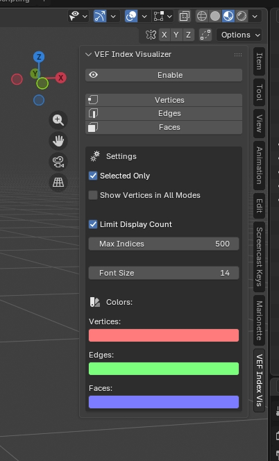

# VEF Index Visualizer

   A simple Blender addon that displays vertex, edge, and face indices in the viewport and adds a panel with buttons in the sidebar (N key) in the **VEF Index Vis** tab.

   

## Installation
   1. Go to the **Releases** section on the right side of this GitHub repository page.
   2. Download the ZIP archive.
   3. Blender 4.2+: `Edit` -> `Preferences` -> `Add-ons` -> `Install from Disk...` -> select the ZIP.  
      Or simply drag the archive into the Blender window.
   4. Enjoy.

## Usage
   1. Open the sidebar in 3D Viewport (press **N**).
   2. Go to the **VEF Index Vis** tab.
   3. Press **Enable** and choose which indices to display.

## Performance Notes
   On high-poly meshes, displaying many indices can slow down the viewport. To improve performance:
   - Enable **Limit Display Count** and set a reasonable maximum.
   - Disable edge/face indices when not needed.
   - Use **Selected Only** mode to show indices only for selected elements.